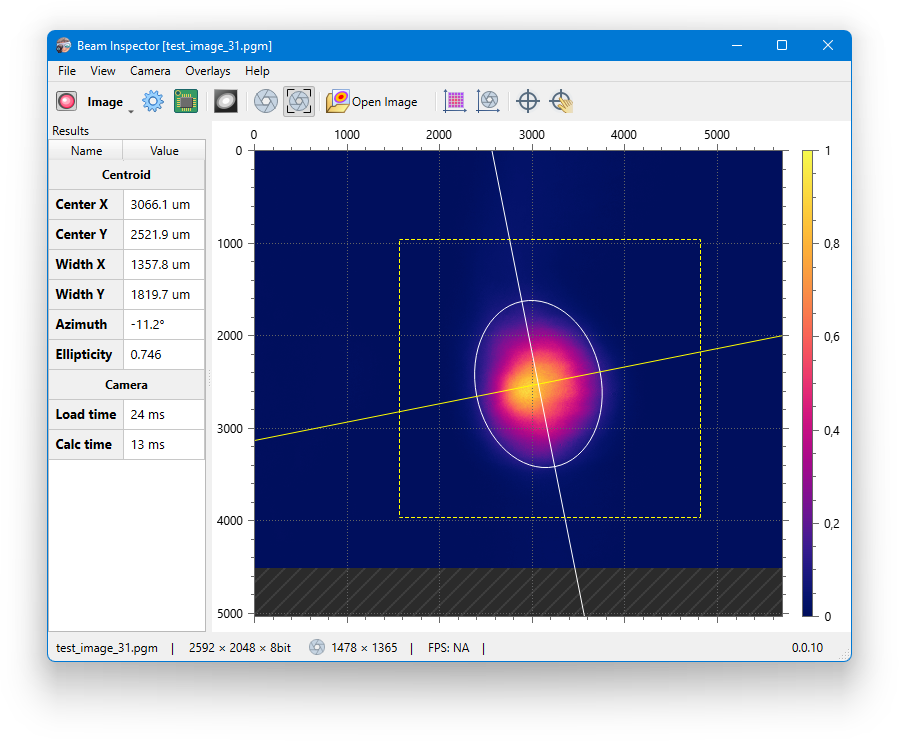

# Beam Inspector

Camera based laser beam profiling application.

## About

Beam Inspector is a standalone desktop application for calculation of beam sizes according the ISO 11146 method of variances. It can process a single monochrome image or a data stream from some types of industrial cameras.

## Supporters

Thank to our friends who made this possible and available for everybody:

