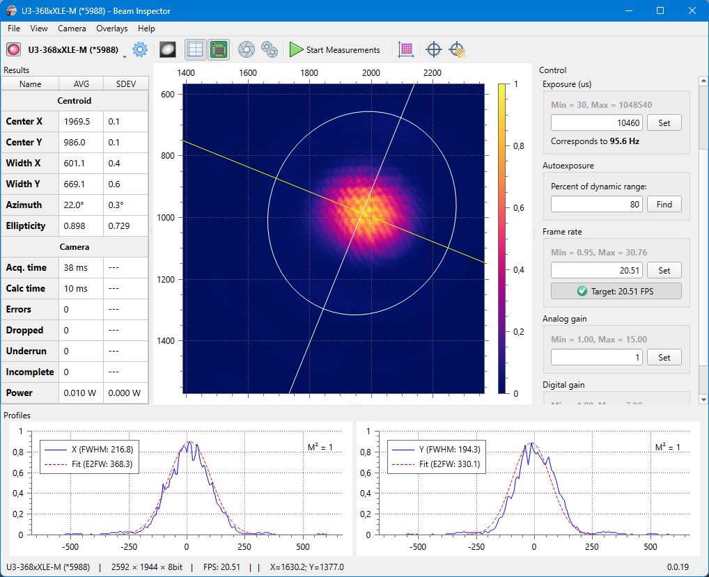

# Beam Inspector

Camera based laser beam profiling application.

Beam Inspector is a standalone desktop application for calculation of beam sizes according the ISO 11146 method of variances. It can process a single monochrome image or a data stream from some types of industrial cameras.

Main features:

- Basic control of the camera exposure parameters (exposure time, analog & digital gain)
- Laser beam width, position, and ellipticity measurements according to ISO 11146.
- Background subtraction
- Area of interest selection (several or multiple regions)
- Laser beam parameter tracking for stability measurements
- Beam position reference overlay
- Analysis of static images
- Variable color maps
- Beam profiles with Gaussian fit

For details, see [online help](./bin/help/index.md) and these video tutorials from [n2-Photonics](https://www.n2-photonics.de):

<!--
Each YouTube video has four generated images, see this question:
https://stackoverflow.com/questions/2068344/how-do-i-get-a-youtube-video-thumbnail-from-the-youtube-api
-->

| Preview                                           | Link                                                                                                                            |
|---------------------------------------------------|---------------------------------------------------------------------------------------------------------------------------------|
|  | [Beam Inspector Tutorial: Installation and basic features](https://www.youtube.com/watch?v=nA2NTfY4zzg)                         |
|  | [Setting up Beam Inpector, free laser beam profiling software, with an IDS camera](https://www.youtube.com/watch?v=WJGz1YlpDeA) |

## Build

See [build instructions](./docs/build.md).

## Supporters

Thanks to our friends who made this possible and available for everyone:

