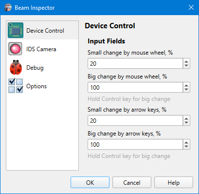

# App Preferences

## Device Control

```
► File ► Preferences ► Device Control
```

A set of options governing how the [camera control](./cam_control.md) panel behaves. Unlike the [camera settings](./cam_settings_hard.md) these options are the same for all cameras.



### Input Fields

Apart from typing them manually, the values in input fields of the control panel can be changed either by the mouse wheel or the arrow keys. The change can be either small or big, the big change happens when one holds the `[Ctrl]` key. 

These options define a percent of the current value that will be added or subtracted from the value when one rotates the mouse wheel ol presses `[Up]` or `[Down]` arrow keys.

The parameters are set in percent for convenience but they are used as multipliers internally. So when you see a big change is 100% this doesn't mean the value will be set to 0 when you press `[Ctrl+Down]`, this means the value will be decreased by 2 times (the same times it will be increased when you press `[Ctrl+Up]`).

There are the [fields](./cam_control.md) affected by these options:


&nbsp;
