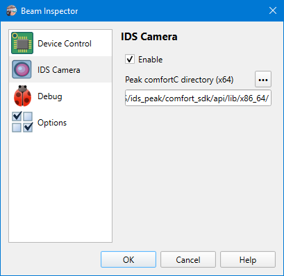

# App Preferences

## IDS Camera

```
► File ► Preferences ► IDS Camera
```



Support for cameras from [IDS](https://de.ids-imaging.com) is optional. To make it working, the [IDS peak SDK](https://en.ids-imaging.com/ids-peak.html) has to be installed separately and a path to it provided. The path should be to a directory containing the `ids_peak_comfort_c.dll` library (64-bit flavor). By default, the SDK installs it into `C:\Program Files\IDS\ids_peak\comfort_sdk\api\lib\x86_64`. If the installation path is different, use the ellipsis button to select it, or type manually, or paste into the input field.

Currently, the SDK 2.0.1.1 has been tested.

Restart the application to apply changes in this window. When the app starts, it loads the SDK (if it's enabled) and lists all available cameras and adds them to the [camera selector](./cam_selector.md).

## See also

- [Supported hardware](./hardware.md)
- [Camera selector](./cam_selector.md)

&nbsp;
