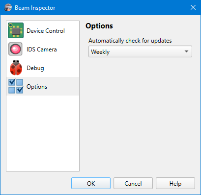

# App Preferences

## Options

```
► File ► Preferences ► Options
```

Different options controlling the application behavior.



### Automatically check for updates

The application can check if there is a new version available on GitHub. The check is performed on application start and happens once in the selected period.

## Tweaks

### Camera control: Round frame rate

It was noticed that [IDS](./hardware.md) cameras return not exactly the same frame rate as it was set. For example, one can set the frame rate to 10, but the camera returns 9.9984 or 9.9992; or it can return 14.9988 instead of 15. The quirk is it happens “sometimes” and the same camera can return the exact value after reconnection. This affects the [exposure presets](./exp_presets.md) because it makes it difficult to highlight the currently active preset. In general, it's not necessary to know frame rate with such precision, so to work around the issue, the application can round the frame rate to the hundredth of a value

### Camera control: Round exposure

The similar issue as with frame rate happens to exposure time. After reconnection, the camera can return a slightly different exposure time. For example, it returns 43001.7μs instead of 43003.8μs that has been set previous time. And it doesn't allow setting the 43001.7μs value like it would be outside the acceptable exposure steps. After reconnection, it can again return 43001.7μs and not allow setting 43003.8μs. Again, the issue impacts the [exposure presets](./exp_presets.md) because it makes it difficult to highlight the currently active preset. For a workaround, the application can round the exposure time to tens of microseconds. Both values in the above example then become 43000μs.

## See also

- [App Preferences: Device Control](./app_settings_hard.md)
- [App Preferences: IDS Camera](./app_settings_ids.md)

&nbsp;
