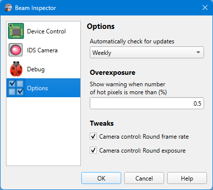

# App Preferences

## Options

```
► File ► Preferences ► Options
```

Different options controlling the application behavior.



### Automatically check for updates

The application can check if there is a new version available on GitHub. The check is performed on application start and happens once in the selected period.

## See also

- [App Preferences: Device Control](./app_settings_hard.md)
- [App Preferences: IDS Camera](./app_settings_ids.md)

&nbsp;
