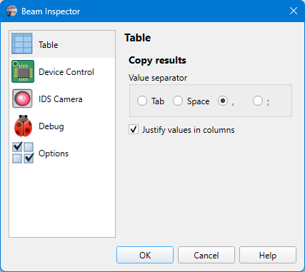

# App Preferences

## Options

```
► File ► Preferences ► Table
```

Different options controlling the application behavior.



### Copy results

Defines how the results are copied to the clipboard when the user selects the Copy command from the context menu of the [results table](./results_table.md).

#### Value separator

Specifies which character is used to separate values in the copied string.

#### Justify values in columns

If results are copied separated with the space character, then the values in the columns are right-justified to make them nice looking in plain-text view. Otherwise, the values are just separated by one space.

```
Center X     1284.5     2.2
Center Y     1011.5     1.1
Width X      1090.9     2.9
Width Y       827.0     1.7
Azimuth       18.8°    1.7°
Ellipticity   0.758   0.568
Power       0.968 W 0.011 W
```

## See also

- [Camera Settings: Table](./cam_settings_table.md)

&nbsp;
