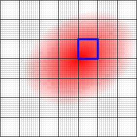

# Brightness

Beam spot brightness is calculated as the maximum among averages of each 8×8 sub-array of the full raw image before [background subtraction](./cam_settings_bgnd.md) and without checking the [ROI](./cam_settings_roi.md). It does not necessarily match the beam center, but provides a quick way for getting a reference value for the [Autoexposure](./cam_control.md#autoexposure) feature. The brightness can also be displayed in the [results table](./results_table.md#brightness) if enabled in the [camera settings](./cam_settings_opts.md).

## See also

- [Camera control](./cam_control.md)
- [Results table](./results_table.md)

&nbsp;
