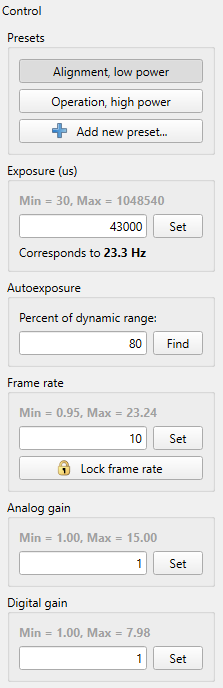

# Camera Control

```
► View ► Device Control
```

There are several camera hardware or driver properties available for changing here. The set of properties depends on the selected [camera type](./hardware.md). Some modes, like [static image](./static_img.md) processing, do not have controls at all.



Type a value into an input field and press the Set button to apply the property or press `[Enter]`. The property will not apply if you just leave the field without hitting the Set button.

Alternatively, there is a convenient way of changing values by the mouse wheel or via the arrow keyboard keys. Select a property and scroll the wheel forward to increase its value, hold the `[Ctrl]` key to get a bigger change. Scroll the wheel backward to decrease the value. The same, press `[Up]` to increase the property or `[Ctrl+Up]` to increase it even more; press `[Down]` or `[Ctrl+Down]` to decrease the value. You can tune the magnitude of such changes via the [Application preferences](./app_settings_hard.md) dialog.

## IDS Cameras

[IDS cameras](./app_settings_ids.md) return the available value range for a property, it's displayed above the field. When you change a property, the range and value of another property can change. For example, **Exposure** and **Frame rate** properties affect one another. The camera changes them automatically, and the application reads and displays the changes instantly.

See details about properties in the official documentation:

- [Exposure](https://www.1stvision.com/cameras/IDS/IDS-manuals/en/exposure-time.html)
- [Frame rate](https://www.1stvision.com/cameras/IDS/IDS-manuals/en/acquisition-frame-rate.html)
- [Gain](https://www.1stvision.com/cameras/IDS/IDS-manuals/en/gain-selector.html)

### Exposure presets


It's possible to save a set of exposure settings for a given camera as a [preset](./exp_presets.md). Presets are listed as buttons at the top of the control panel and can be managed via the context menu.

### Autoexposure


Not every camera model supports the auto exposure feature. So the application implements a simple software algorithm for finding an exposure value giving desired beam spot [brightness](./brightness.md).

The algorithm starts from the shortest possible exposure and increases it until the spot brightness reaches the specified percent of the largest value of data type. For example, for 8-bit images the value 80% should give brightness about *255 × 0.8 = 204* and the beam center should be colored orange (provided we use a blue-yellow [color map](./color_map.md)).

In practice, the calculated brightness slightly differs from frame to frame. Here is for example a graph of calculated brightness over several thousand frames. The slow change is a drift from the light source, the fast change is probably digital noise, or maybe the light source has fast flickering. Anyway, such fast changes can spoil the algorithm.


To deal with the issue, the algorithm takes several frames for each exposure value and averages brightness over them. The number of frames for averaging can be set in the [Camera settings](./cam_settings_opts.md#autoexposure) dialog.

### Frame rate locking


When changing the exposure either manually or during autoexposure, the frame rate can change as well and can go to very small values, when the exposure gets too long. Then, when the exposure is changed back to short values, the frame rate remains low, and it's required to change it back to high values manually, which is inconvenient.

The “Lock frame rate” button allows remembering the current frame rate and using it as some target value. When the exposure changes, the application always tries to set this target frame rate for the camera. This way, the frame rate is always kept at the desired value when it's allowed by the camera hardware. If it's not, the warning icon is displayed on the button.


## See also

- [Supported hardware](./hardware.md)
- [Application preferences](./app_settings_hard.md)

&nbsp;
