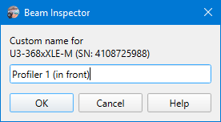

# Camera name

```
► Camera ► Custom Name
```

Allows for setting a descriptive and user-friendly name for a camera. The name is stored locally in user preferences (not in the camera itself) using camera model and serial number as a key. The name is displayed in the [camera selector](./cam_selector.md) instead of model name and serial number. The [status bar](./status_bar.md) always shows model name and serial number, so this information is still available even when the custom name is used.



## See also

- [Camera selector](./cam_selector.md)
- [Status bar](./status_bar.md)

&nbsp;
