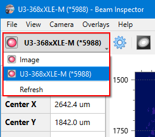

# Camera Selector

Click the selector to open a drop-down containing supported cameras and available working modes. Click an item to activate a mode or connect to a camera.

### Image

Switches the app to the [static images](./static_img.md) processing mode and automatically loads the previously opened image or shows the image selector dialog. This is the default mode activated when the application starts. This mode activates automatically when one opens an image via the `[File ► Open]` menu command.

### Camera list

Shows detected [cameras](./hardware.md) by their model names and shortened serial numbers. Alternatively a [custom name](./cam_name.md) for a particular camera can be shown in the list. The [status bar](./status_bar.md) also shows the model name and serial number of the opened camera.

Select an item from the list to open a camera. If the camera is already opened it will be closed and reopened. This is required to apply several [camera settings](./cam_settings_hard.md) that only can be applied before camera starts acquisition. Such settings are marked with the "Reselect camera to apply" label in the dialog.

### Refresh

Detects supported cameras and updates selector items. The app does not permanently monitor for available cameras so when a camera is disconnected or a new camera attached to your PC the list does not update automatically. Use this command to display the actual camera list.

## See also

- [Static images](./static_img.md)
- [Supported hardware](./hardware.md)

&nbsp;
