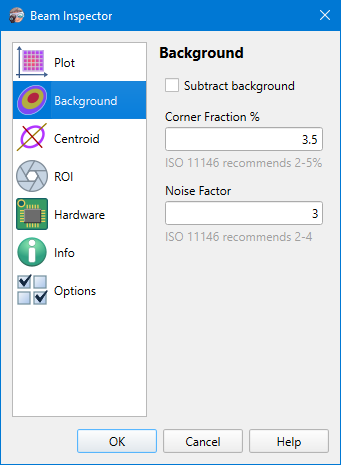

# Camera Settings

Camera settings are stored on a per-camera basis, so when another [camera is selected](./cam_selector.md) then other settings will be loaded. Camera model name and serial number used as a key for settings string. And there is a separate set of settings for [static images processing](./static_img.md), they do not differ for different images.

## Background

```
► Camera ► Settings ► Background
```



### Subtract background

Apply background offset correction according to ISO 11146-3. The standard proposes several methods of background correction. Here we use the Statistical and Approximation methods described in the standard sections 3.4.2 and 3.4.3.

### Corner Fraction

Background subtraction starts from calculation of the mean <i>E<sub>mean</sub></i> and standard deviation <i>E<sub>sdev</sub></i> of an unilluminated image. It can be calculated from previously stored dark map images. Alternatively a part of the image itself can be used for that. The ISO suggests using image corners, considering them as "dark". The size of these dark corners is given in percent of image size and recommended range is 2..5%.

### Noise Factor

Pixels whose values are less than an illumination threshold <i>E<sub>mean</sub> + N * E<sub>sdev</sub></i> considered unilluminated. Their average gives a baseline offset value, which has to be subtracted from the measured data. Recommended values for the noise factor <i>N</i> are 2..4.

*(ISO 11146-3 suggests that the baseline offset should be calculated on a convoluted image. This is an image consisting of averaged values of sub-arrays of m x n pixels of the original image. This part is omitted for the sake of calculation speed and the baseline offset is calculated by averaging all pixels of the original image which are below the illumination threshold)*

## See also

- [Centroid calculation](./cam_settings_centr.md)

&nbsp;