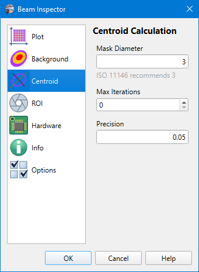

# Camera Settings

Camera settings are stored on a per-camera basis, so when another [camera is selected](./cam_selector.md), then other settings will be loaded. The model name of the camera and its serial number used as a key for settings string. And there is a separate set of settings for [static images processing](./static_img.md), they do not differ for different images.

## Centroid Calculation

```
► Camera ► Settings ► Centroid
```

These options control how to calculate beam centroid parameters (position, diameters). These options only apply when [background subtraction](./cam_settings_bgnd.md) is enabled. Otherwise, simple [calculation](./iso.md) over unmodified image data (respecting [ROI](./cam_settings_roi.md)) is performed.



### Mask Diameter

According to ISO 11146-1 all [integrations](./iso.md) should be performed in an area centered at the beam and several times larger than the beam width. Since the beam width is initially unknown, the first integration is done over the whole image (respecting [ROI](./cam_settings_roi.md)), and obtained centroid parameters used for defining the new integration area. From which new centroid parameters are calculated, then the next integration area and so on until convergence of the results is obtained.

The mask diameter defines now many times the integration area size is larger than the beam width. Recommended value is 3.

### Max Iterations

The parameter defines how many times integration area should be calculated from the previous centroid parameters. If it is 0 then there are no iterations. So centroid parameters are only obtained from the entire image (respecting [ROI](./cam_settings_roi.md)) and no new integration area is calculated.

### Precision

If the centroid parameters calculated on an iteration differ from parameters obtained on the previous iteration not more than a given fraction, then results are considered convergent and iterations stop.

Practically, on good images, it's often enough to calculate centroid parameters only once (Max Iterations = 0). 

## See also

- [Background subtraction](./cam_settings_bgnd.md)
- [ISO 11146 Equations](./iso.md)
- [ROI](./cam_settings_roi.md)

&nbsp;
