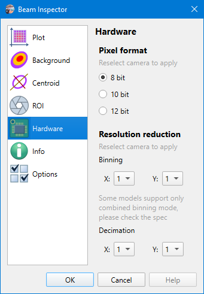

# Camera Settings

Camera settings are stored on a per-camera basis, so when another [camera is selected](./cam_selector.md), then other settings will be loaded. The model name of the camera and its serial number used as a key for settings string. And there is a separate set of settings for [static images processing](./static_img.md), they do not differ for different images.

## Hardware

```
► Camera ► Settings ► Hardware
```



### Pixel format

[Bit depth](https://www.1stvision.com/cameras/IDS/IDS-manuals/en/basics-bit-depth.html) is the number of bits used to code the color of a single pixel. For IDS cameras, supported formats are `Mono8` (8 bit), `Mono10G40` (10 bit), and `Mono12G24` (12 bit). See camera specs and [official documentation](https://www.1stvision.com/cameras/IDS/IDS-manuals/en/basics-monochrome-pixel-formats.html) for details.

After changing the option, re-select the camera in the [camera selector](./cam_selector.md) to apply.

### Resolution reduction

Resolution reduction techniques can be used to reduce the CPU load the bandwidth requirements on the USB.

**Binning** allows for reducing image size by averaging pixels over several rows or/and columns. See the [official documentation](https://www.1stvision.com/cameras/IDS/IDS-manuals/en/basics-binning.html) for details.

Some cameras support only combined binning mode, they can't average only rows or only columns separately; both X and Y values must be set to the same value. See the specs of your camera for details.

**Decimation** (or subsampling) allows for reducing image size by skipping several rows or/and columns of pixels. See the [official documentation](https://www.1stvision.com/cameras/IDS/IDS-manuals/en/basics-decimation.html) for details.

Cameras can not apply both binning and decimation at the same time, so when one option is set, the other gets locked.

After changing these options, re-select the camera in the [camera selector](./cam_selector.md) to apply.

## See also

- [Supported cameras](./hardware.md)
- [Camera selector](./cam_selector.md)

&nbsp;
