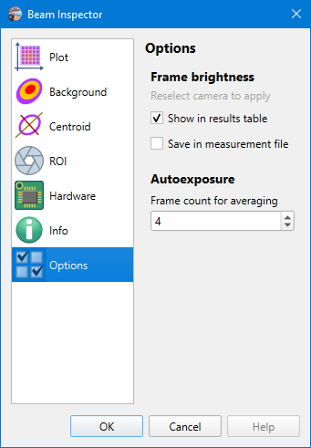

# Camera Settings

Camera settings are stored on a per-camera basis, so when another [camera is selected](./cam_selector.md), then other settings will be loaded. The model name of the camera and its serial number used as a key for settings string. And there is a separate set of settings for [static images processing](./static_img.md), they do not differ for different images.

## Options

```
► Camera ► Settings ► Options
```



### Frame brightness

By default, the [brightness](./brightness.md) is calculated only when the [auto-exposure](./cam_control.md#autoexposure) feature is used. But when it is required for debugging or another reason, the calculation can be enabled for every frame. The brightness value can be output to the [results table](./results_table.md) or saved in [measurements](./measure.md) file.

### Autoexposure

Defines how many frames must be taken for getting the averaged brightness for the [auto-exposure](./cam_control.md#autoexposure) feature

## See also

- [Camera control](./cam_control.md)

&nbsp;
