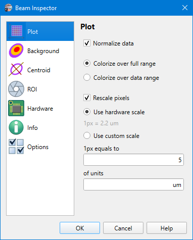

# Camera Settings - Plot

```
► Camera ► Settings ► Plot
```



## Options

### Normalize data

Bring all pixel values to the [0..1] range normalizing them by a maximum value. The maximum value is either a maximum among all pixel values or the largest possible magnitude for data type (e.g. 255 for 8-bit images) depending on the value of the "Colorize over..." option (see below).

*(The option does not apply in the [Raw View](./raw_view.md) mode)*

&nbsp;

### Colorize over full range

Do image normalization and apply [color map](./color_map.md) using the largest value of data type (e.g. 255 for 8-bit images).

E.g. for 8-bit images

- if the "Normalize data" flag is set then all pixel values are divided by 255

- if a blue-yellow color map is selected then the yellow color corresponds to the value 225 (no normalization) or 1 (with normalization)

*(The option does not apply in the [Raw View](./raw_view.md) mode)*

&nbsp;

### Colorize over data range

Do image normalization and apply [color map](./color_map.md) using a value that is a maximum among all image pixels.

E.g. for an 8-bit image where the brightest pixel has value 150:

- if the "Normalize data" flag is set then all pixel values are divided by 150

- if a blue-yellow color map is selected then the yellow color corresponds to the value 150 (no normalization) or 1 (with normalization)

*(The option does not apply in the [Raw View](./raw_view.md) mode)*

&nbsp;

### Rescale pixels <a id=rescale-pixels>&nbsp;</a>

Multiply image width and height by some factor to display the beam plot and result values in physical units rather than in pixels.

The scale factor depends on a value of the "Use ... scale" options (see below).

&nbsp;

### Use hardware scale

The app tries to extract a physical size of pixel from camera properties. 

For [cameras](./hardware.md) supporting GenICam protocol, this is done by reading the `SensorPixelWidth` and `SensorPixelHeight` features. See [GenICam naming convention](https://www.emva.org/wp-content/uploads/GenICam_SFNC_v2_4.pdf) (PDF, online)

&nbsp;

### Use custom scale

When usage of the hardware pixel size is not possible or not desirable, then the scale factor can be set manually.

In this case one even can specify an arbitrary unit of measurement. This affects how calculation results are [displayed](./results_table.md).

&nbsp;

## See also

- [Raw View](./raw_view.md)
- [Color maps](./color_map.md)
- [Supported cameras](./hardware.md)
- [Results table](./results_table.md)

&nbsp;