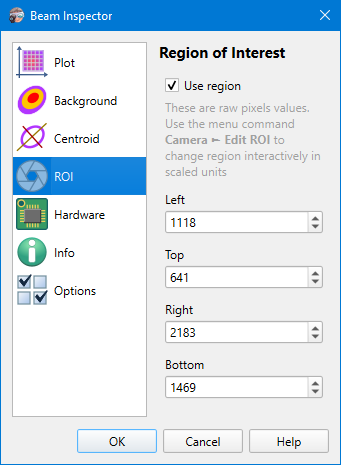
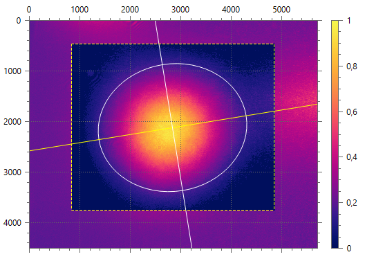

# Camera Settings

Camera settings are stored on a per-camera basis, so when another [camera is selected](./cam_selector.md) then other settings will be loaded. Camera model name and serial number used as a key for settings string. And there is a separate set of settings for [static images processing](./static_img.md), they do not differ for different images.

## Region of Interest

```
► Camera ► Settings ► ROI
```



### Use region

When enabled, only part of image used for [calculation](./cam_settings_centr.md) and [background subtraction](./cam_settings_bgnd.md). Borders of the region are drawn on the plot as dashed lines.

The flag can also be toggled via the `[Camera ► Use ROI]` menu command or respective button on the toolbar.



Some cameras allow for defining ROI on hardware or driver level. This camera feature is not currently used. The app always resets a camera ROI, acquires the full frame, and implements ROI as software bounds for processing data. No temporary cropped image is generated.

### Left, Top, Right, Bottom

ROI bounds are set in raw pixels. Even if the [Rescale pixels](./cam_settings_plot.md#rescale-pixels) option is activated, it is not used here. If it's important to define ROI bounds in physical units then use the [Live ROI](./roi_live.md) feature.

When ROI is enabled the aperture icon and ROI size is displayed in the [status bar](./status_bar.md). The icon turns red when some of the ROI edges exceed the image bounds. This can happen when the [camera resolution](./cam_settings_hard.md) is changed, or in case of [static images](./static_img.md) processing another smaller image has been loaded. Invalid ROI does not break calculations, just a nearest image bound is used then.

## Related commands

- `Camera ► Edit ROI`
- `Camera ► Use ROI`
- `View ► Zoom to Sensor`
- `View ► Zoom to ROI`

## See also

- [Background subtraction](./cam_settings_bgnd.md)
- [Centroid calculation](./cam_settings_centr.md)
- [Live ROI editing](./roi_live.md)

&nbsp;
