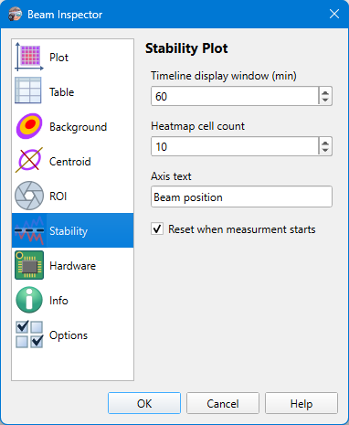

# Camera Settings

Camera settings are stored on a per-camera basis, so when another [camera is selected](./cam_selector.md), then other settings will be loaded. The model name of the camera and its serial number used as a key for settings string. And there is a separate set of settings for [static images processing](./static_img.md), they do not differ for different images.

## Stability

```
► Camera ► Settings ► Stability
```

The page controls the behavior the the [Stability panel](./stability_view.md).



### Timeline display window

The duration of the visible timeline slice. The stability panel accumulates all the data since the observation started, but to keep the plot cleaner and save CPU resources, it shows only a part of all points.

### Heatmap cell count

The resolution of the positional stability heatmap plot. Both X and Y axes use the same resolution.

### Axis text

The text displayed on the timeline and heatmap axes. Though the stability panel always analyzes the beam position, sometimes the position can be interpreted differently, for example, as the beam angle.

When the pixel rescaling is enabled in the [plot settings](./cam_settings_plot.md), the the unit of measurement is automatically added to the axis text, so there is no need to include it here manually.

### Reset when measurement starts

If the option is set, the stability plots get reset when a new measurement starts.

## See also

- [Stability View](./stability_view.md)
- [Camera Settings: Plot](./cam_settings_plot.md)

&nbsp;