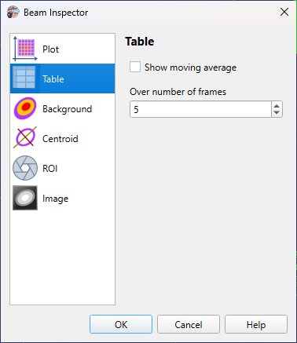

# Camera Settings

Camera settings are stored on a per-camera basis, so when another [camera is selected](./cam_selector.md), then other settings will be loaded. The model name of the camera and its serial number used as a key for settings string. And there is a separate set of settings for [static images processing](./static_img.md), they do not differ for different images.

## Table

```
► Camera ► Settings ► Table
```



### Show moving average

When selected, the results that shows in the [results table](./results_table.md) are avareged over specified number of frames. Also, the standard deviation is calculated for each frame and shown in the table in a separate column.

### Over number of frames

Number of frames over which the moving average is calculated.

## See also

- [Results table](./results_table.md)

&nbsp;
