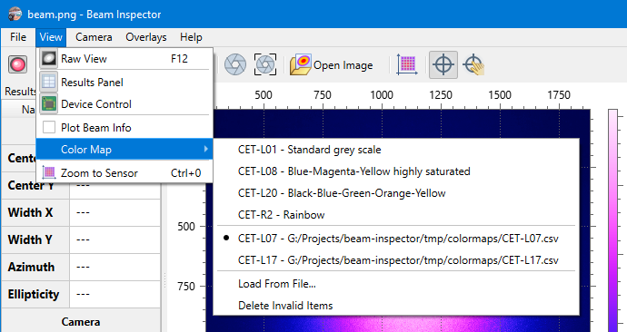

# Color Maps

```
► View ► Color Map
```

Color map defines a color gradient used for displaying intensity values in a way when image features are better recognizable by human eyes than in the straightforward gray scale representation. See the [ColorCET](https://colorcet.com/index.html) resource for some theory.

Color map does not affect any calculations and only changes the look of the [beam view](./plot.md).



## External maps

BeamProfiler includes several generic color maps taken from ColorCET. If they are not enough, you can [download](https://colorcet.com/download/index.html) the full set of prepared color maps and select a preferable one from there. The application understands gradients stored in the integer CSV format. Look for the “CSV integer RGB values in the range 0-255.” row on the download page. Alternatively, there is the [direct link](https://colorcet.com/download/CETperceptual_csv_0_255.zip) to a ZIP file. Unpack the archive and load a CSV file with the `[View ► Color Map ► Load From File]` menu command. 

## See also

- [Beam view](./plot.md)

&nbsp;
