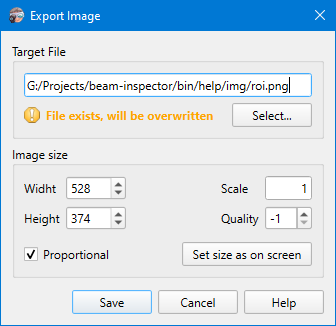
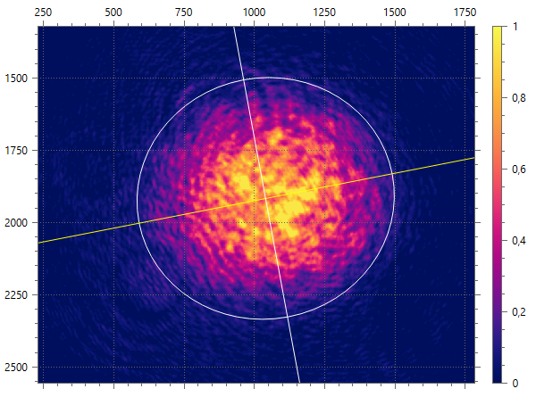
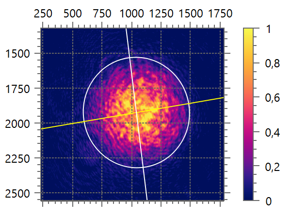

# Export Plot Image

```
► File ► Export Plot Image [F7]
```

Saves the current beam view, including beam ellipse, color scale, and calculation results, into an image file. To toggle drawing of calculation results, use the `[View ► Plot Beam Info]` menu command. Use the Select button to specify a target file name and image format. PNG and JPG formats are supported.



The dialog allows for specifying the exact **Width** and **Height** of the target image, the beam view will be re-plotted into that size without bitmap scaling artifacts.

If the **Proportional** flag is checked, then when you change a width or height, the other side will be adjusted accordingly to receive the same relative change.

The **Scale** defines the plotting scale factor. For example, when you set `Width=600` and `Scale=1` you get an image of 600px width like if you have resized the window to that width.



When you set `Width=300` and `Scale=2` you get the image of 600px width having all font sizes and line thickness doubled. This can be useful for generation of presentation images with high resolution.



The **Quality** factor must be in the range 0 to 100 or -1. Specify 0 to obtain small compressed files, 100 for large uncompressed files, and -1 to use the default settings.


In the [Raw view](./raw_view.md) mode this command does almost the same as the [Export raw image](./export_raw.md) command does but provides more settings for the output image.

## See also

- [Beam view](./plot.md)
- [Raw view](./raw_view.md)
- [Export raw image](./export_raw.md)

&nbsp;
