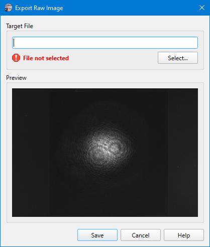

# Export Raw Image

```
► File ► Export Raw Image [F6]
```

Saves the latest captured frame into a file without any scaling and processing. Use the Select button to specify a target file name and image format. PNG, JPG, and PGM formats are supported. Note that JPEG images have lossy compression and are not recommended for scientific data.



## See also

- [Export plot image](./export_plot.md)