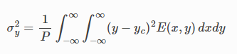

# ISO 11146

ISO 11146 is intended to provide a simple, consistent way of describing the width of a beam.

## Equations

### Total power

The total power <i>P</i> is obtained by integrating the irradiance <i>E(x,y)</i> over the entire beam

The center of the beam can be found by

### Beam center

These parameters are displayed as **Center X** and **Center Y** in the [Results table](./results_table.md) and in [Measurement files](./measure.md), as **Xc** and **Yc** on the [Beam view](./plot.md).

### Variance

A useful parameter characterizing a general two-dimensional distribution <i>E(x,y)</i> is the variance in the <i>x</i> and <i>y</i> directions

### Beam radius

For a Gaussian distribution centered at (0,0) with <i>1/e2</i> radius <i>w</i> we find

This leads to the definition of the beam radius adopted by ISO 11146

### Principal axes

Axes of the maximum and minimum beam extent based on the centered second order moments of the power density distribution in a cross section of the beam.

The <i>x</i>-axis diameter <i>dx = 2wx</i> is given by

The <i>y</i>-axis diameter <i>dy = 2wy</i> is given by

These parameters are displayed as **Width X** and **Width Y** in the [Results table](./results_table.md) and in [Measurement files](./measure.md), as **Dx** and **Dy** on the [Beam view](./plot.md).

### Tilt angle

This is measured as a positive angle counter-clockwise between the <i>x</i>-axis of the laboratory system and that of the principal axis of the power density distribution which is closer to the x-axis

If the principal axes make the angle <i>π/4</i> with the <i>x</i>- and <i>y</i>-axes of the laboratory coordinate system, then <i>dx</i> is by convention the larger beam width.

This parameter is displayed as **Azimuth** in the [Results table](./results_table.md) and in [Measurement files](./measure.md), as **φ** on the [Beam view](./plot.md).

### Ellipticity

Ratio between the minimum and maximum beam widths

Circular power density distribution - power density distribution having an ellipticity greater than 0.87.

This parameter is displayed as **Ellipticity** in the [Results table](./results_table.md) and in [Measurement files](./measure.md), as **ε** on the [Beam view](./plot.md).

### Eccentricity

## See also

- [Results table](./results_table.md)
- [Beam view](./plot.md)
- [Centroid Calculation](./cam_settings_centr.md)
- [Measurements](./measure.md)

&nbsp;
