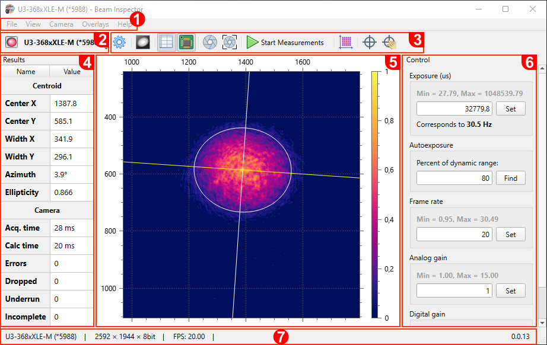

# Main Window

1) Main menu
2) [Camera selector](./cam_selector.md)
3) Main toolbar
4) [Results panel](./results_table.md)
5) [Beam view](./plot.md)
6) [Control panel](./cam_control.md)
7) [Status bar](./status_bar.md)

&nbsp;
