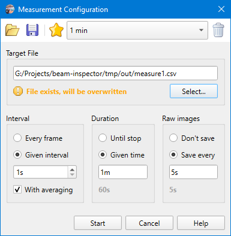

# Measurements

```
► Camera ► Start Measurements [F9]
► Camera ► Stop Measurements [F9]
```

During the measurement every frame captured from the camera gets processed, beam shape is [calculated](./iso.md), and results are saved into a CSV file. A progress bar is displayed in the [status bar](./status_bar.md) and the "Start" command changes to "Stop". Most of the other commands and options get locked ensuring the all results saved into the target file correspond to the same camera settings.



## Measurement config

### Target file

Calculation results are saved into a CSV file a path to that is specified in this field. The first two columns in the target file are the result number and the measurement timestamp in the [ISO 8601](https://en.wikipedia.org/wiki/ISO_8601) format. All the rest columns are the same as in the [results table](./results_table.md). Additionally the [Brightness](./brightness.md) column is added if it is enabled in the [camera settings](./cam_settings_opts.md). 

The target file is not locked during the measurements and can be read by an external app at any time. The file is only written time to time by blocks of 1000 results.

Additionally an INI file is written with the same name containing measurement configuration, [camera settings](./cam_settings_bgnd.md), and some [camera property](./cam_control.md) values (frame rate, exposure, etc.). This file later can be used as a measurement preset (see below) to repeat measurements with the same configuration. This settings file also stores counters and messages of errors when they happen, the same as listed in the [results table](./results_table.md#errors).

So for the example with the screenshot above there will be three entities created - file `measure1.csv`, file `measure1.ini`, and directory `measure1.images` (see below).

### Interval

When the "Every frame" flag is checked then calculation results of every frame are saved as a separate row in the target file. This can result in a big file.

When the "Given interval" flag is checked then only one result per the interval is saved. The results for other frames will either be dropped or accumulated and averaged if the "With averaging" flag is checked.

### Duration

If the measurement duration is not set then calculation results will be written into the target file continuously until the `[Camera ► Stop Measurements]` command is invoked.

### Raw images

If an interval is given then some captured frames are saved into a subdirectory named after the measurement file name but with the suffix `.images`. For example if the `measure1.csv` file name is selected for the target as shown on the screenshot above, then a directory `measure1.images` will be created nearby and captured frames will be saved into that as PGM files named after capturing time, e.g. `2024-06-27T00-56-44-042.pgm`. Time is formatted according to the [ISO 8601](https://en.wikipedia.org/wiki/ISO_8601) standard having the local timezone in mind and with milliseconds.

Time for the Duration and Raw images fields must be given as a string with units `h`, `m`, and `s`. E.g. `600s`, or `10m`, or `2h 10m`. The string gets parsed and the interval duration in seconds is displayed underneath or an error message if the string is invalid.

## Toolbar

Commands for manipulating with measurement configuration presets.

### Import config

Loads the measurements configuration file previously saved by the "Export config" command. Alternatively a measurement settings INI file can be opened and the configuration will be loaded from there.

### Export config

Saves the current settings entered in the dialog into an INI file.

### Save preset

Saves the current settings entered in the dialog as a named preset. Preset are stored locally in the application settings.

### Preset list

A drop-down showing a list of named preset. Select a name in the prop-down to apply saved measurement settings.

### Delete preset

Deletes a preset selected in the presets drop-down. Current values in the dialog are not affected.

## See also

- [Centroid evaluation](./cam_settings_centr.md)
- [ISO 11146 equations](./iso.md)
- [Results table](./results_table.md)

&nbsp;