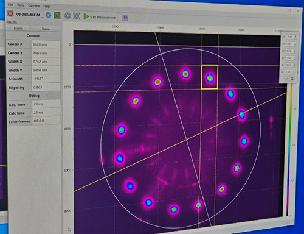
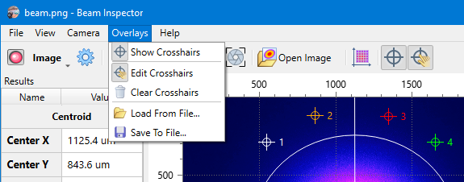
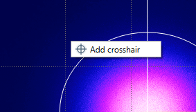
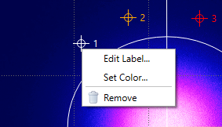

# Overlays

Beam Inspector supports drawing overlays on top of the [beam view](./plot.md).

Currently, there is the only type of overlays supported — crosshairs. These can serve as alignment references for the laser beam. In particular, [n2-Photonics](https://www.n2-photonics.de) uses them to mark the beam positions in their optical multipass cells.



## Usage



### Toggle crosshairs

The overlay can be shown and hidden via the `[Overlays ► Show Crosshairs]` menu command or via the toolbar button “Show Crosshairs”

### Create crosshairs

By default, editing is disabled. To add a crosshair, enable the edit mode via the `[Overlays ► Edit Crosshairs]` menu command or via the toolbar button “Edit Crosshairs”. Then select “Add Crosshair” in the context menu of the plot `[right click ► Add Crosshair]`. This option is only available when crosshair editing is enabled.



## Edit crosshairs

In the edit mode, existing crosshairs can be moved around the image by dragging them by the mouse. The label next to the crosshair as well as its color can be changed in the crosshairs' context menu available by the right mouse button click.



## Remove crosshairs

An individual crosshair can be removed in its context menu. All crosshairs can be removed via the [`Overlays ► Clear Crosshairs`] menu command.

## Save and load crosshairs

Crosshairs can be saved to disk and loaded from disk via `[Overlays ► Save To File…]` and `[Overlays ► Load From File…]`, respectively. This way, reference points can be transferred from one PC to another easily. The data associated with the crosshairs is stored in a human-readable JSON format.

Example:

```json
{
  "crosshairs": [
    {
      "color": "#ffffff",
      "label": "1",
      "x": 0.10,
      "y": 0.10
    },
    {
      "color": "#ff0000",
      "label": "2",
       "x": 0.80,
       "y": 0.10
    },
  ]
}
```

Edits to the file will only take effect after reloading the crosshairs via the `[Overlays ► Load From File…]` menu command.

Crosshair locations are stored in relative coordinates. This allows for using the same crosshair set with different camera resolutions and makes them resilient to changing camera [binning or decimation](./cam_settings_hard.md#resolution-reduction).

## See also

- [Beam view](./plot.md)

&nbsp;
