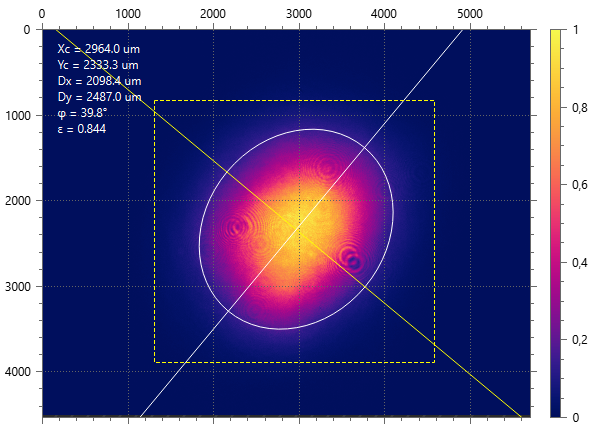

# Beam view

The main part of the application window displays either a [raw beam](./raw_view.md) spot image or a spot with calculated [beam shape](./iso.md) ellipse and axes drawn above. The plot can also optionally display numeric calculation results the same as in the [results table](./results_table.md) if that is enabled by the `[View ► Plot Beam Info]` menu command.

For the sake of performance, the plot is not updated with the same [frame rate](./cam_control.md) as the camera captures. Even though the beam shape is evaluated for every frame, the results are used only for [measurements](./measure.md), but the beam view is updated only several times per second.

Horizontal and vertical axes are graduated either in pixels or in physical units if this is enabled in [camera settings](./cam_settings_plot.md#rescale-pixels). The intensity scale at the right is graduated either in raw data values (e.g., in range 0…255 for 8-bit images) or in relative magnitudes in range 0…1 if the normalization is enabled in [camera settings](./cam_settings_plot.md). A color of the beam spot depends on a [color map](./color_map.md) selected in the `[View ► Color Map]` menu.

The ROI can be enabled either in the [camera settings](./cam_settings_roi.md) dialog or by the `[Camera ► Use ROI]` menu command, then it's drawn on the plot as a yellow dashed rect. There is also an interactive [Live ROI edit](./roi_live.md) mode, then ROI bounds are drawn differently and can be dragged by the mouse.

All of what is visible on the plot at a moment, including the beam spot, beam shape, calculation results, can be [exported](./export_plot.md) into an image file.

Use the mouse wheel to zoom the view, drag with the left mouse button to pan the view.

## Related commands

- `File ► Export Plot Image`
- `Camera ► Edit ROI`
- `Camera ► Use ROI`
- `View ► Plot Beam Info`
- `View ► Color Map`
- `View ► Zoom to Sensor`
- `View ► Zoom to ROI`

## See also

- [Raw view](./raw_view.md)
- [Centroid calculation](./iso.md)
- [Calculation results](./results_table.md)
- [Plot settings](./cam_settings_plot.md)
- [Color map](./color_map.md)
- [ROI](./cam_settings_roi.md)
- [Live ROI editing](./roi_live.md)
- [Overlays](./overlays.md)

&nbsp;
