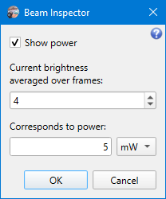
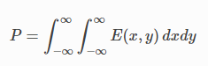

# Power Meter

```
► Camera ► Power Meter
```

This feature allows using the camera as a simplistic power meter.



When one hits the OK button, a calibration procedure starts. It calculates an averaged “digital power” of the beam for the given number of frames. Then the application treats this power as being matched to the specified physical power magnitude and calculates a digital-to-physical power scale factor. For every subsequent frame, its “digital power” gets multiplied by this scale factor and displayed in physical power units in the [Results table](./results_table.md).

Digital power is calculated as an integral over all pixels inside the specified [ROI](./cam_settings_roi.md):



This value is already calculated as a part of the main [beam estimation](./iso.md) algorithm, so almost no additional computation is required for the power meter feature, and it doesn't involve additional noticeable CPU loading.

When the feature is enabled by the “Show power” flag, the estimated power values are also saved in target files during [measurement](./measure.md).

The scale factor gets invalid when the ROI is changed or [camera parameters](./cam_control.md) adjusted. The power row in the Results table will show a warning highlight. In this case, a new calibration procedure should be run: open this dialog and just hit OK.

## See also

- [Results table](./results_table.md)
- [Beam estimation](./iso.md)

&nbsp;