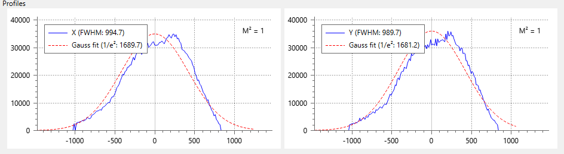

# Profiles View

```
► View ► Profiles View
```



The panel shows the cross-sections (profiles) of the beam spot over principal axes and an optional Gaussian fit for the data.

For profile graphs, the full width at half maximum (FWHM) is shown. For the fitted graphs, the view calculates the Gaussian beam width at 1/e² level. Conventionally, the Gaussian beam width is given as a radius, but here it's displayed as a diameter (full width) to make it easier to compare with values displayed in the [results table](./results_table.md). The value is marked as E2FW on the plots.

Horizontal axis labels of the profile plots and beam width values are displayed either in pixels or in physical units if this is enabled in [camera settings](./cam_settings_plot.md#rescale-pixels).

## Context menu commands

### Show Gaussian Fit

Calculate the Gaussian fit for the profile points. If the option is not checked, then only measured data is plotted. The command affect both plots simultaneously.

### Center Fit at Zero

Show the Gaussian fit graph centered at zero. If the option is not checked, the graph is centered at the maximal profile point. The command affect both plots simultaneously.

### Set Beam Quality (M²)

Set the beam quality parameter (M²) for the Gaussian fit calculation. The command affect both plots simultaneously.

### Copy Profile Points

Copy the profile points to the clipboard in CSV format. The command operates on a plot under the mouse cursor.

### Copy Fitted Points

Copy the fitted points to the clipboard in CSV format. The command operates on a plot under the mouse cursor.

### Copy as Image

Copy the plot as an image to the clipboard. The command operates on a plot under the mouse cursor.

### Autoscale plots

Force the plots to recalculate ranges of horizontal and vertical axes to optimally display all data.
