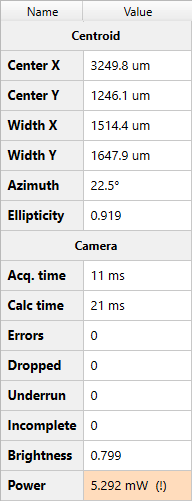

# Results Table

```
► View ► Results Panel
```



## Centroid

Results of beam [centroid evaluation](./cam_settings_centr.md) calculated using equations suggested by the [ISO 11146](./iso.md) standard. These results are also optionally output in the [Beam view](./plot.md). Check the flag `[View ► Plot Beam Info]` to enable.

### Center X, CenterY

Coordinates of the beam ellipse center in pixels or in physical units (e.g. microns), if they are configured in the [camera settings](./cam_settings_plot.md#rescale-pixels).

### Width X, Width Y

Sizes of the beam ellipse center in pixels or in physical units (e.g. microns), if they are configured in the [camera settings](./cam_settings_plot.md#rescale-pixels). The X-axis is drawn in yellow in the [Beam view](./plot.md).

### Azimuth

Tilting angle between the X-axis of the sensor (laboratory axis) and the largest size of the beam ellipse. According to ISO 11146 the angle is CCW positive, but the Y-axis of images conventionally directed top-to-bottom on the screen, so on the [Beam view](./plot.md) the positive azimuth looks CW oriented.

### Ellipticity

Relative difference between minimum and maximum of beam ellipse widths.

## Camera

Some data dependent on [selected camera](./hardware.md).

### IDS cameras

#### Errors

The number of generic errors happened during frame processing. The table does not explain errors, only shows their count. But when the [measurements](./measure.md) are started the error messages are saved into measurement files.

#### Dropped

The number of frames received out of order. This can mean that selected acquisition frame rate is too high and connection bandwidth gets overloaded.

#### Underrun

The number of frames for which there are no free buffers to receive. This can indicate the lack of CPU resources, frame processing takes too long. See also the FPS counter in the [Status bar](./status_bar.md), it gets highlighted red when the real processed frame rate is below that [set in camera](./cam_control.md).

#### Incomplete

The number of frames for which a part of data has not been correctly transferred. This is a sign of a connection problem.

#### Brightness

Beam spot [brightness](./brightness.md) doesn't have a big practical reason and is mostly intended for testing the [Autoexposure](./cam_control.md#autoexposure) feature, so the row is displayed only if enabled in the [camera settings](./cam_settings_opts.md).

## See also

- [Centroid evaluation](./cam_settings_centr.md)
- [ISO 11146 equations](./iso.md)
- [Supported hardware](./hardware.md)
- [Measurements](./measure.md)

&nbsp;
