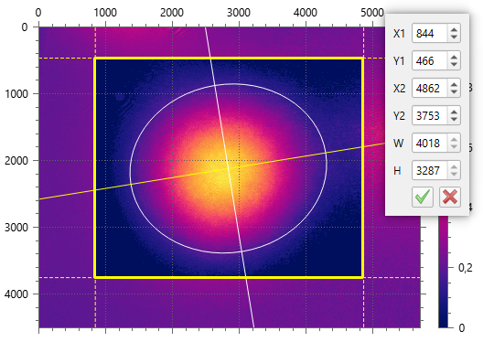

# Live ROI editing

```
► Camera ► Edit ROI
```



This mode allows for specifying [ROI](./cam_settings_roi.md) interactively by dragging its bounds by the mouse. 

Alternatively, the precise bound values can be typed in edit boxes in the top-right corner panel. Unlike editing ROI via the [Camera Settings](./cam_settings_roi.md) dialog, these editors respect the [Rescale pixels](./cam_settings_plot.md#rescale-pixels) option and accept values in physical units, if they are configured.

Accept changed bounds by pressing the “Checkmark” button on the panel, or hitting the `[Enter]` on the keyboard, or double-clicking the mouse.

Reject changes by pressing the “Cross” button on the panel, or hitting the `[Esc]` on the keyboard.

ROI bounds are stored in relative coordinates. This makes them resilient to changing camera [binning or decimation](./cam_settings_hard.md#resolution-reduction). But after activation the mode the next time, you can see difference ±1 pixel compared to previously entered values due to rounding errors after recalculation into relative values and back to pixels.

## Related commands

- `Camera ► Settings ► ROI`
- `Camera ► Use ROI`
- `View ► Zoom to Sensor`
- `View ► Zoom to ROI`

## See also

- [ROI](./cam_settings_roi.md)

&nbsp;