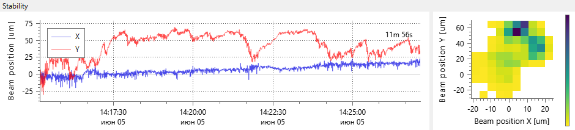

# Stability View

```
► View ► Stability View
```



The panel shows the evolution of the beam center position. It allows for checking if the beam drifts.

The panel shows the difference of the beam center relative to a start position. The start position is fixed when the observation begins — when one switches the camera, opens the panel, or calls the Reset command.

There are two kinds of plots here: timeline and heatmap.

The timeline shows results along time. The panel accumulates all the data since the observation started, but to keep the plot cleaner, it shows only a part of all points (by default, for the latest 1h). The duration of the visible timeline slice can be [configured](./cam_settings_stabil.md).

The heatmap shows a distribution of the relative beam position around the starting point (positional stability). Colors indicate the number of times the beam center falls into the area. The resolution of the plot can be controlled via [settings](./cam_settings_stabil.md). The color map is automatically ranged such that the darker color is applied to the cell with the greatest population, with lower valued populations proportionally spread across brighter colors.

The panel collects data only if it's turned on by the command `View ► Stability View`. When the panel gets closed, the data is cleaned to save memory and CPU resources.

When the pixel rescaling is enabled in the [plot settings](./cam_settings_plot.md), then graphs also get rescaled accordingly, and the unit of measurement is automatically added to the axes texts. Even though the panel always analyzes the beam position, sometimes the position can be interpreted differently, for example, as the beam angle. Then another axis text can be provided via [settings](./cam_settings_stabil.md).

## Context menu commands

### Reset

Clears plots and starts a new observation session from the clean sheet. The reset could happen automatically when the measurement starts, if it's enabled in the [settings](./cam_settings_stabil.md). The reset is also called automatically when the panel is closed.

### Copy X Points

Copy data of the X graph to the clipboard in CSV format. All points are copied, not only the visible part of the graph.

### Copy Y Points

Copy data of the Y graph to the clipboard in CSV format. All points are copied, not only the visible part of the graph.

### Copy X and Y Points

Copy data of both X and Y graphs to the clipboard in CSV format. X and Y values go to different columns of the same table. All points are copied, not only the visible part graphs.

### Copy as Image

Copy the plot as an image to the clipboard. The command operates on a plot under the mouse cursor.

## See also

- [Camera Settings: Stability](./cam_settings_stabil.md)
- [Camera Settings: Plot](./cam_settings_plot.md)

&nbsp;