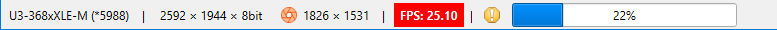

# Status Bar

## Panels

Hover the mouse over a panel to show a tooltip with additional information.

Panels of the status bar from left to right:

### Camera identifier

Displays model name and shortened serial number of the [selected camera](./cam_selector.md). A tooltip shows the full serial number. This panel does not respect [custom names](./cam_name.md) for cameras and always shows the hardware identifier. When processing [static images](./static_img.md), it displays the image file name.

### Image resolution

Shows pixel size and the bit depth of [camera frame](./cam_settings_hard.md) or loaded [static image](./static_img.md).

### ROI

Shows the region size when [ROI is enabled](./cam_settings_roi.md). The icon turns red when the region does not fit for loaded image or selected camera resolution.

### FPS

Calculated number of frames that the app processes in a second. If the value does not match the frame rate set in the [camera properties](./cam_control.md), the panel turns red. This indicates a lack of CPU resources.

### Background warning

The exclamation warning icon is displayed when [background subtraction](./cam_settings_bgnd.md) is disabled. Calculation results are considered not compliant to the ISO standards then.

### Measurements progress

When [measurements](./measure.md) are started, a bar is displayed showing the measurements progress in percent. Hover the mouse to see a tooltip providing additional info about the measurements: remaining time, target file, etc.

## See also

- [Camera selector](./cam_selector.md)
- [Image processing](./static_img.md)
- [Camera resolution](./cam_settings_hard.md)
- [Camera control](./cam_control.md)
- [Region of interest](./cam_settings_roi.md)
- [Background subtraction](./cam_settings_bgnd.md)
- [Measurements](./measure.md)

&nbsp;
